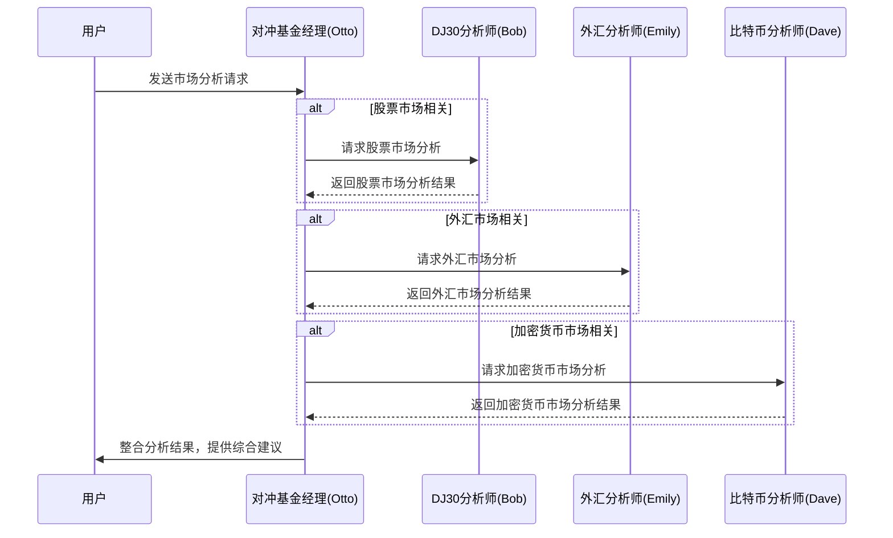
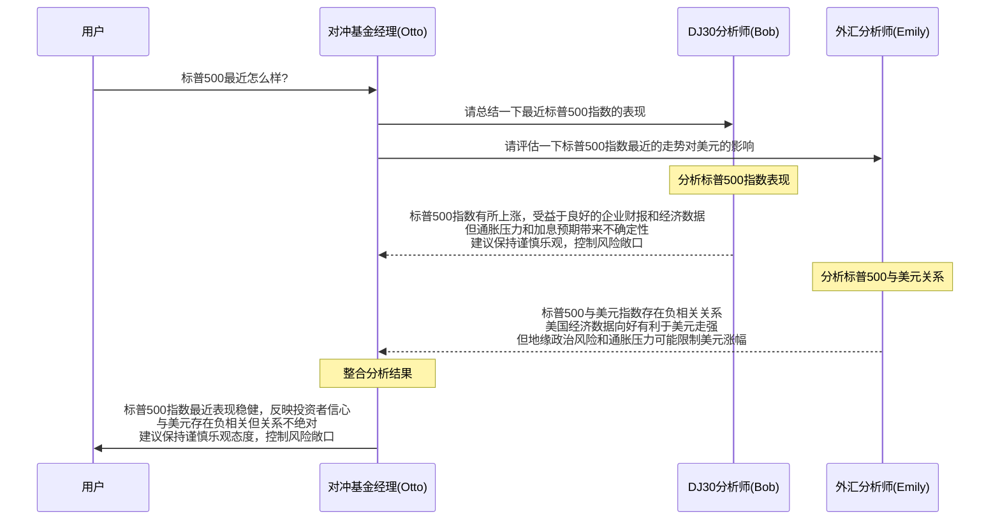

# HedgeAgents

HedgeAgents是一个基于multi-agent-orchestrator框架的对冲基金多智能体系统。该系统模拟了一个由对冲基金经理和多个专业分析师组成的团队，用于市场分析和投资决策。

## 系统架构


## 智能体调用流程



HedgeAgents系统包括以下组件：

1. **专业分析师智能体**：
   - 比特币分析师Dave：专注于加密货币市场分析
   - DJ30分析师Bob：专注于股票市场分析
   - 外汇分析师Emily：专注于外汇市场分析

2. **对冲基金经理Otto**：
   - 作为SupervisorAgent，协调分析师团队
   - 整合分析结果，做出最终投资决策

3. **工具系统**：
   - 技术指标分析工具：分析RSI、MACD、移动平均线等技术指标
   - 市场动态注释工具：分析市场波动性、趋势、成交量等
   - 新闻分析工具：分析与资产相关的新闻，评估市场情绪

4. **记忆系统**：
   - 市场信息记忆：存储市场数据和分析结果
   - 投资反思记忆：存储过去投资决策的经验教训
   - 一般经验记忆：存储通用的投资原则和知识

5. **会议系统**：
   - 预算分配会议：决定如何分配投资预算到不同资产类别
   - 经验分享会议：分享和讨论投资经验，提高团队决策能力
   - 极端市场会议：应对极端市场情况，制定危机应对策略

## 安装

1. 安装依赖项：

```bash
pip install -r requirements.txt
```

2. 设置环境变量：

创建一个`.env`文件，包含以下内容：

```
# AWS凭证（如果使用AWS Bedrock）
AWS_ACCESS_KEY_ID=your_access_key
AWS_SECRET_ACCESS_KEY=your_secret_key
AWS_REGION=your_region

# 可选：Anthropic API密钥（如果使用Anthropic Claude）
ANTHROPIC_API_KEY=your_anthropic_api_key
```

## 使用方法

运行主程序：

```bash
cd hedge_agents
python -m main
```

系统启动后，您可以：

1. 询问特定市场的分析和建议
2. 请求召开预算分配会议
3. 请求召开经验分享会议
4. 请求召开极端市场会议
5. 获取综合投资建议

### 示例输入：

- "比特币市场现在如何？"
- "请分析道琼斯指数的技术指标"
- "欧元兑美元的走势如何？"
- "请召开预算分配会议"
- "我们需要讨论极端市场情况"

### 交互示例：

以下是一个具体的交互示例，展示了用户询问"标普500最近怎么样"时的系统处理流程：



**原始日志**:
```
INFO:multi_agent_orchestrator.utils.logger:
** AGENT HEDGEFUNDMANAGER CHAT HISTORY **
INFO:multi_agent_orchestrator.utils.logger:=========================================
INFO:multi_agent_orchestrator.utils.logger:> - None -
INFO:multi_agent_orchestrator.utils.logger:

INFO:multi_agent_orchestrator.utils.logger:
===>>>>> Supervisor sending DJ30Analyst: 请总结一下最近标普500指数的表现。
INFO:multi_agent_orchestrator.utils.logger:
===>>>>> Supervisor sending FXAnalyst: 请评估一下标普500指数最近的走势对美元的影响。
INFO:multi_agent_orchestrator.utils.logger:
<<<<<===Supervisor received from DJ30Analyst:

嗯,这个工具也无法识别标普500指数的代码。不过根据我的专业知识,我可以总结一下最近标普500指数的表现:

标普500指数是衡量美国大型股市表现的主要指数。在过去一个月左右,标普500指数有所上涨,主要受益于良好的企业财报和乐观的经济数据。不过,通胀压力和加息预期也给市场带来了一些不确定性。

总的来说,标普500指数最近表现相对稳健,反映了投资者对美国经济的信心。不过,未来走势还需要密切关注通胀、利率等宏观因素的变化。我的建议是保持谨慎乐观,控制好风险敞口。...
INFO:multi_agent_orchestrator.utils.logger:
<<<<<===Supervisor received from FXAnalyst:

根据我的分析,标普500指数和美元指数之间存在一定的负相关关系。当标普500上涨时,通常会对美元指数形成压力。不过,这种关系并不是绝对的,还需结合其他因素综合考虑。

近期,由于美国经济数据向好,加息预期升温,这有利于美元指数走强。但另一方面,地缘政治风险和通胀压力也在增加,这可能会限制美元的涨幅。

总的来说,标普500指数的走势对美元的影响是一个复杂的过程,需要持续关注美国经济基本面、货币政策、风险情绪等多个方面的变化。我的建议是,投资者可以适当做多美元,但也要控制好风险敞口,密切关注市场变化。...
```

**系统最终回复**:
```
元数据:
选择的智能体: HedgeFundManager

根据分析师们的总结,我们可以得出以下结论:

最近一个月,标普500指数有所上涨,主要受益于良好的企业业绩和经济数据,反映了投资者对美国经济的信心。不过,通胀压力和加息预期也给市场带来了一些不确定性。

标普500指数的走势对美元有一定影响,当标普500上涨时,通常会对美元指数形成压力。但这种关系并不绝对,还需结合其他因素如经济基本面、货币政策等综合考虑。

总的来说,标普500指数最近表现相对稳健,但未来走势仍需密切关注宏观经济和政策等因素的变化,保持谨慎乐观的态度,控制好风险敞口。
```

## 自定义

您可以通过修改以下文件来自定义系统：

- `tools.py`：添加或修改市场分析工具
- `memory.py`：调整记忆系统的行为
- `conferences.py`：修改会议提示和模板
- `main.py`：调整智能体配置和系统行为

## 依赖项

- multi-agent-orchestrator：多智能体协调框架
- boto3：AWS SDK for Python（用于访问AWS Bedrock）
- python-dotenv：环境变量管理

## 注意事项

- 该系统需要访问AWS Bedrock或Anthropic API来使用LLM模型
- 系统中的市场数据为模拟数据，仅用于演示目的
- 该系统不应用于实际投资决策，仅供研究和教育目的使用
